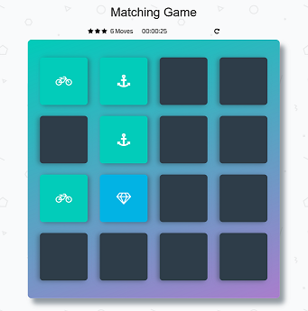
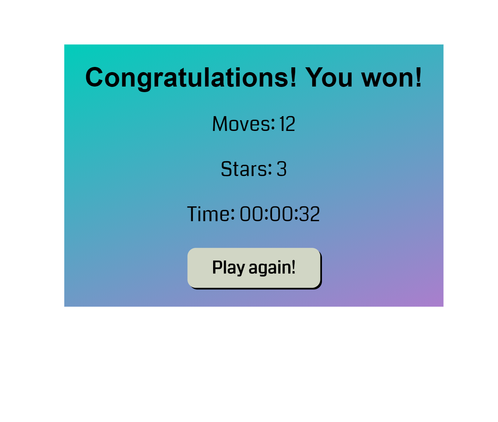

# Memory Game

### Running The Application

The application can be run by clicking [here](https://wbchristerson.github.io/memory-game/). To download, you can clone the repository using this terminal command:
```
git clone https://github.com/wbchristerson/memory-game.git
```

Alternatively, follow the instructions below to download to a hard drive:
* Click the green "Clone or download" button above then choose "Download ZIP".
* Find the folder `memory-game-master` in your Downloads folder or wherever it was placed on your device.
* Right click and choose "Extract All", then extract.
* Open your browser and use `Ctrl + O` (for Windows machines) to open the file selector on your device.
* Go to `memory-game-master`, enter `memory-game-master` again, then select `index.html`. The game screen will appear.

### Structure
* The user must match 8 pairs of cards which are initially all covered.
* When a card is clicked, it is flipped, illuminated in blue, and its symbol is made visible.
* When two matching cards have been selected in this way, they both remain visible and turn aquamarine; the user may then immediately select again if there are remaining unmatched cards.
* When two non-matching cards have been selected, they both flip over again after one
second, obscuring the image and re-coloring as gray.
* When all cards have been matched, the game ends and a final screen appears congratulating the player and listing various statistics about the user's game. There is an additional "play again" button.

### Design
The main screen includes a timer, a move counter, a reset button, and a star rating. Below is an example of the interface:

<p align="center">
  
</p>

Finishing the game with at most 15 moves yields a 3-star rating, finishing with more than 16 moves but at most 25 yields a 2-star rating, and finishing with more than 25 moves yields a 1-star rating. Here is an example end page:

<p align="center">
  
</p>

### Remaining Issues
* When a card is flipped, its hidden image appears before it finishes flipping over. This is okay stylistically but I would prefer that the image appeared with a short delay of maybe about 200 milliseconds. I have tried to implement this with the jQuery `setTimeout` and `.delay()` functions, but have not been able to make it work correctly.
